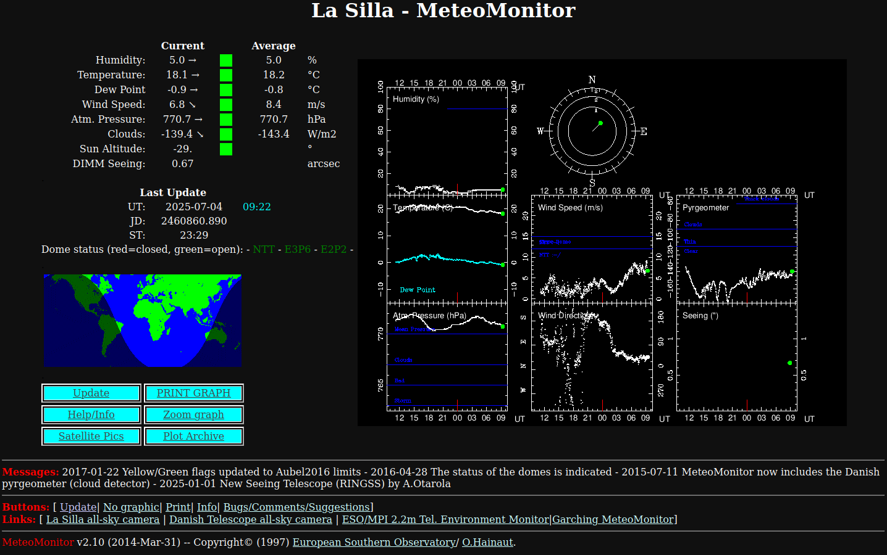

# meteoMonitor

Ancient code for the ESO La Silla meteoMonitor web page, and its (slightly) more recent clone in Garching.

meteoMonitor was a very early attempt to display the information from the La Silla observatory on the web in real-time, when the web was new, and the idea of real-time was even newer. It started as a prototype to explain the users' requirements to the software engineers.

The [La Silla MeteoMonitor](https://www.ls.eso.org/lasilla/dimm/) has been in operations since 1997. It produces a page like the screenshot below every minute.

It is here for legacy, and with the hope that the La Silla meteoMonitor will eventually be retired and replaced by something slightly more modern.

## Dependencies

The code is an horrible mix of c-shell and Fortran;

The graphics are generaged using [superMongo](https://www.astro.princeton.edu/~rhl/sm/).

The nice little map of the day/night regions on Earth is generated with [XEarth](https://xearth.org/).

